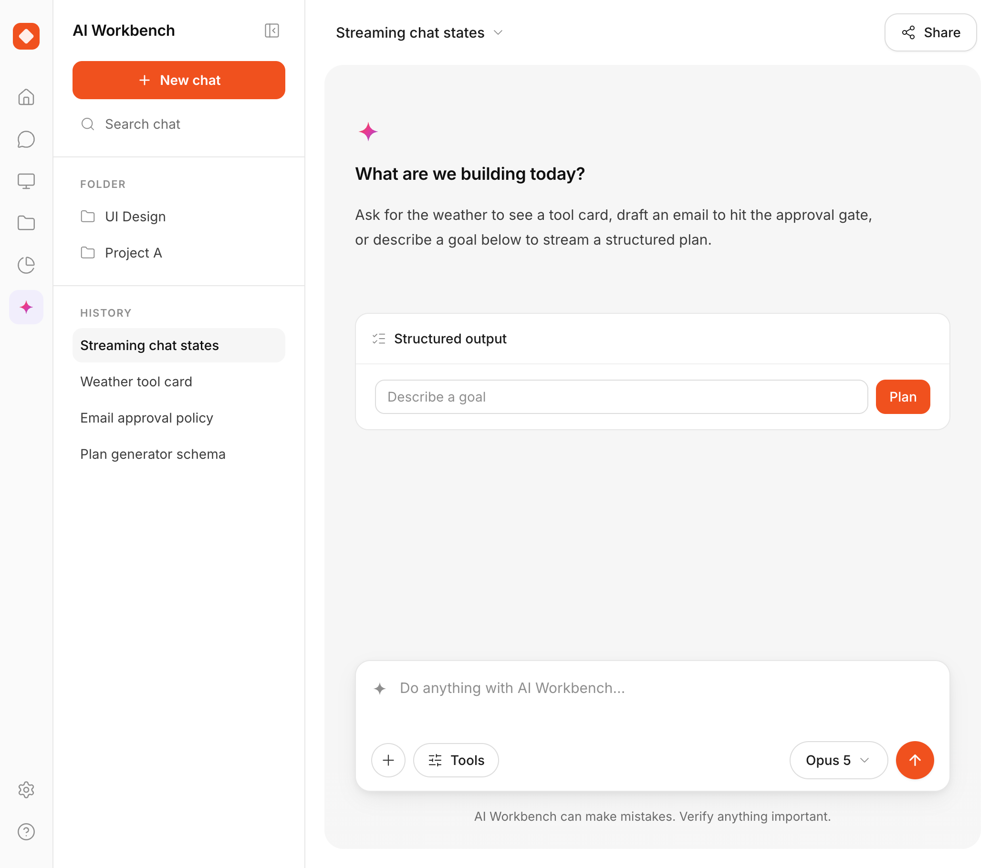

# AI Workbench

> A frontend-first AI engineering lab: streaming chat, tool calling, human-in-the-loop agents, structured outputs, LLM observability and evals — built with Vite, React, TypeScript and Tailwind CSS.

**Status:** All seven phases are built, plus the UI in [DESIGN.md](./DESIGN.md). Not deployed — see [Out of scope](./ROADMAP.md#out-of-scope) for what is deliberately not being built and why.



The empty state is also the tour: ask for the weather to get a tool card, draft an
email to hit the approval gate, or describe a goal to stream a structured plan.

---

## Why this project exists

Most AI demos stop at "call the API and print the text". This lab goes further and exercises the practices that separate a toy from a production AI product:

- **Streaming UIs** — token-by-token rendering, loading/error states done right.
- **Tool calling & generative UI** — the model triggers typed tools, the UI renders their results as components.
- **Human-in-the-loop (HITL)** — dangerous tools require explicit user approval before executing.
- **Structured outputs** — Zod-validated JSON streamed into typed React state.
- **Observability** — every trace, span and generation visible in Langfuse.
- **Evals** — a small dataset + scripted checks so changes don't silently regress quality.

## Tech stack (August 2026)

### Installed

| Layer                     | Tech                                      | Notes                                                                                                                                  |
| ------------------------- | ----------------------------------------- | -------------------------------------------------------------------------------------------------------------------------------------- |
| Package manager / runtime | **Bun**                                   | `bun.lock` is the lockfile; Bun also runs TypeScript directly (no `tsx` needed)                                                        |
| Build                     | **Vite 8**                                | Rolldown (Rust) is the default bundler — no separate `rolldown-vite` package. Requires Node `^20.19.0 \|\| >=22.12.0` if not using Bun |
| UI                        | **React 19** + **TypeScript 7**           | TS 7 is the native (Go-based) compiler — `tsc -b` works as before, ~10x faster                                                         |
| Styling                   | **Tailwind CSS v4**                       | CSS-first config via `@theme` — no `tailwind.config.js`, no PostCSS config                                                             |
| Linting                   | **oxlint**                                | Rust-based linter — replaces ESLint; config in `.oxlintrc.json`                                                                        |
| Formatting                | **Prettier 3**                            | `bun run format`; config in `.prettierrc` (no semicolons, single quotes, 4-space indent)                                               |
| AI                        | **Vercel AI SDK** (`ai`, `@ai-sdk/react`) | Transport-based `useChat` / `useObject`, tool calling, `needsApproval` for HITL                                                        |
| Server                    | **Hono**                                  | Tiny API server proxied by Vite in dev; runs natively on Bun                                                                           |
| Validation                | **Zod**                                   | Tool `inputSchema` and the structured-output schemas shared with the client                                                            |
| Testing                   | **Vitest** + Testing Library              | Two projects: `unit` (node) and `ui` (jsdom) — see `vite.config.ts`                                                                    |
| Observability             | **Langfuse JS SDK v5**                    | OpenTelemetry-based; traces via `LangfuseVercelAiSdkIntegration`, feedback as numeric scores                                           |
| E2E                       | **Playwright**                            | Chromium; specs stub `/api/*` so they need no API key                                                                                  |
| CI                        | **GitHub Actions**                        | `.github/workflows/ci.yml` — checks, E2E, and evals (evals on `main` / manual only)                                                    |

> **Note on runtimes:** the project is driven with Bun. If you run anything with Node instead, use Node 22.12+ — Vite 8 requires `20.19+`/`22.12+`, and `@langfuse/vercel-ai-sdk` requires Node 22+.

## Architecture

```
┌──────────────────────────┐        ┌───────────────────────────┐
│  Vite dev server :5173   │        │  Hono API server :8787    │
│  React 19 + Tailwind v4  │ /api → │  AI SDK (streamText,      │
│  useChat / useObject     │ proxy  │  tools, agents)           │
└──────────────────────────┘        │  Langfuse span processor  │
                                    └────────────┬──────────────┘
                                                 │
                                    LLM provider (Anthropic /
                                    Google) + Langfuse
```

The frontend never holds API keys. All model calls happen in `server/`, and Vite proxies `/api/*` to it during development.

## Getting started

### Prerequisites

- [Bun](https://bun.sh) 1.x (the project's package manager and script runner)
- Alternatively Node 22.12+, but the lockfile is Bun's

### Install and run

```bash
bun install
bun run dev
```

`dev` starts both processes via `concurrently`: the Vite server on http://localhost:5173 and the Hono API on :8787, with `/api/*` proxied to it. You need one provider API key in `.env` for the model calls — `ANTHROPIC_API_KEY`, or `GOOGLE_GENERATIVE_AI_API_KEY` with `AI_PROVIDER=google` to use Google's free tier (see [Environment](./ROADMAP.md#environment) and [Provider selection](./ROADMAP.md#provider-selection)); the test suite runs without either.

### Scripts

```jsonc
{
    "scripts": {
        "dev": "concurrently -n web,api \"vite\" \"bun --watch server/index.ts\"",
        "build": "tsc -b && vite build",
        "lint": "oxlint",
        "preview": "vite preview",
        "format": "prettier --write .",
        "type-check": "tsc -b",
        "test": "vitest run",
        "e2e": "playwright test",
        "eval": "bun run evals/run.ts",
    },
}
```

> Run the tests with `bun run test` (Vitest), **not** `bun test` — Bun's own
> runner ignores `vite.config.ts`, so the jsdom environment never loads and
> every component test fails with `document is not defined`.

`test` and `e2e` need no API key — the first injects a mock model, the second
stubs `/api/*`. `eval` is the one that spends tokens: it runs the scored dataset
against the real model and exits non-zero if the pass rate drops below the
threshold in `evals/dataset.json`.

Tracing is opt-in: without `LANGFUSE_PUBLIC_KEY` / `LANGFUSE_SECRET_KEY` the
server logs a warning and runs untraced.

## Roadmap

Work is organized in seven phases: streaming chat, tool calling + generative UI, human-in-the-loop, structured outputs, observability, evals, and production polish. Per-phase checklists, setup steps and reference snippets live in [ROADMAP.md](./ROADMAP.md).

## Design

The UI spec — layout grid, design tokens, component anatomy and measurements — lives in [DESIGN.md](./DESIGN.md). Tokens are declared with `@theme` in `src/index.css`.

## SEO

The static `<head>` in `index.html` carries the title, description, robots,
`color-scheme`, and the Open Graph / Twitter text tags. Icons live in `public/`
as the brand diamond in three forms (SVG, 32px PNG, 180px PNG for iOS), and
`public/robots.txt` keeps `/api/` out of the index. `e2e/seo.spec.ts` fetches
every icon the document declares and fails on a non-200.

Three tags need an absolute origin, so they are **not** in the head yet. Add them
when the app gets a domain, and uncomment the `Sitemap:` line in `robots.txt`:

```html
<link rel="canonical" href="https://YOUR-DOMAIN/" />
<meta property="og:url" content="https://YOUR-DOMAIN/" />
<meta property="og:image" content="https://YOUR-DOMAIN/og.png" />
```

With an `og:image` in place, switch `twitter:card` from `summary` to
`summary_large_image`.

One honest limit: this is a client-rendered SPA with no SSR, so a crawler that
does not execute JavaScript sees an empty `#root`. The head is the whole
indexable surface — making the conversation itself indexable would mean SSR or
prerendering.

## Project structure

```
ai-workbench/
├── .github/workflows/     # CI: checks, E2E, evals
├── docs/                  # README assets (screenshot)
├── public/                # favicon set + robots.txt
├── server/
│   ├── index.ts           # Real model + telemetry + port; entry point
│   ├── app.ts             # Hono app built from injected deps
│   ├── routes/            # chat (streamText), plan (streamObject), feedback
│   ├── middleware/        # Rate limiting
│   ├── observability/     # Observability port + Langfuse implementation
│   ├── tools/             # AI tools (Zod schemas + execute)
│   └── test-support/      # Mock model + recording observability
├── src/
│   ├── domain/            # Pure logic + Zod schemas shared with the server
│   │   ├── chat/          # Status rules
│   │   ├── tools/         # Tool contracts + approval policy
│   │   └── objects/       # Structured-output schemas
│   ├── components/
│   │   ├── shell/         # AppShell, icon rail, sidebar, top bar
│   │   ├── ui/            # Card, IconButton, Sparkle — the shared primitives
│   │   ├── chat/          # Canvas, message list, composer, code + tool cards
│   │   └── plan/          # useObject panel for streamed structured output
│   ├── test/setup.ts
│   ├── App.tsx
│   └── index.css
├── evals/                 # Phase 6
│   ├── dataset.json       # Input → expected behaviour pairs
│   └── run.ts             # Scripted eval runner
├── e2e/                   # Playwright specs: chat, plan, shell, SEO
└── README.md
```

`src/domain/` holds no React and no I/O, so both the server and the browser
import from it — that is what keeps the Zod schemas a single source of truth.

## Contributing

Issues and PRs are welcome — this lab is built in public, so questions and ideas count as contributions too.

1. Fork the repo and create a feature branch (`feat/...`).
2. Run `bun run format` and `bun run lint` before committing.
3. Make sure `bun run test` and `bun run e2e` pass before opening a PR — neither needs an API key. `bun run eval` is optional locally (it needs a provider API key and spends tokens); CI runs it on `main`.

## References

- Bun — https://bun.sh
- Vite — https://vite.dev
- oxlint — https://oxc.rs
- Tailwind CSS v4 (Vite install) — https://tailwindcss.com/docs/installation/using-vite
- AI SDK — https://ai-sdk.dev/docs/introduction
- `useChat` reference — https://ai-sdk.dev/docs/reference/ai-sdk-ui/use-chat
- Langfuse × AI SDK — https://langfuse.com/integrations/frameworks/vercel-ai-sdk
- Hono — https://hono.dev

## License

[MIT](./LICENSE)
